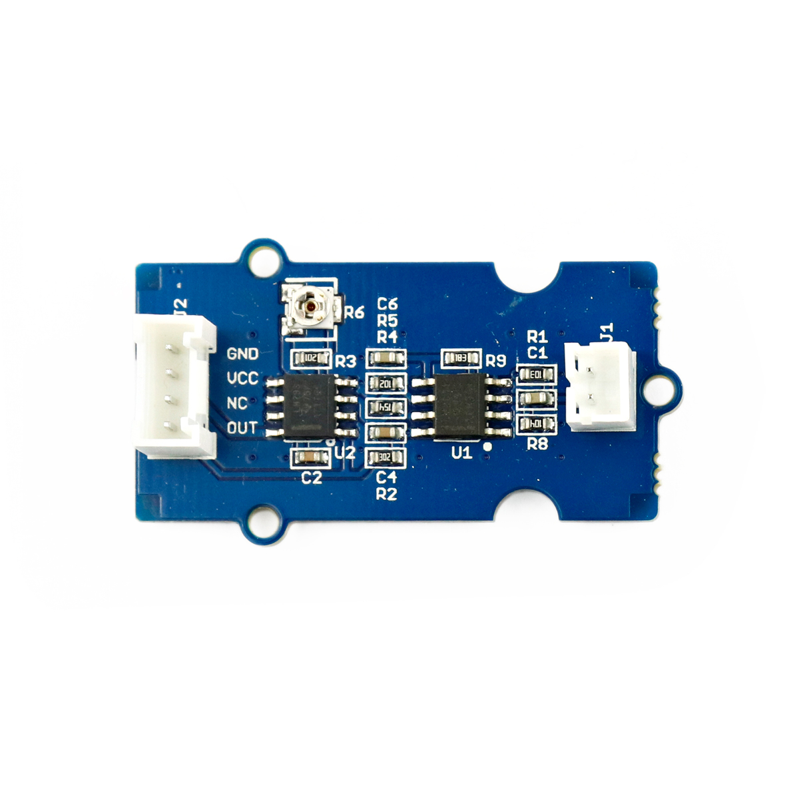

---
title: "Vibrationssensor"
date: "2018-10-01T13:28:09.000Z"
tags: 
  - "sensor"
coverImage: "13_vibrationssensor.jpg"
material_number: "13"
material_type: "sensor"
material_short_descr: "Seeed Studio Grove – Piezo Vibration Sensor"
manufacture: "Seeed Studio"
manufacture_url: "https://www.seeedstudio.com/"
repo_name: "mks-SeeedStudio-Grove_Piezo_Vibration_Sensor"
repo_prefix: "mks"
repo_manufacture: "SeeedStudio"
repo_part: "Grove_Piezo_Vibration_Sensor"
product_url: "https://wiki.seeedstudio.com/Grove-Piezo_Vibration_Sensor/"
clone_url: "https://github.com/Make-Your-School/mks-SeeedStudio-Grove_Piezo_Vibration_Sensor.git"
embedded_example_file: "examples/Grove_Piezo_Vibration_Sensor_minimal/Grove_Piezo_Vibration_Sensor_minimal.ino"
---

# Vibrationssensor

## Beschreibung
Der Vibrationssensor erfasst jegliche Art von Erschütterungen. Jedes Mal, wenn der Sensor vorwärts und rückwärts bewegt wird, gibt er einen Spannungsimpuls aus und erfasst damit eine Erschütterung. Die Sensitivität kann mit einem integrierten Potentiometer (Drehwiderstand) eingestellt werden und definiert die Erschütterungsfrequenz.

Der Sensor kann direkt oder mithilfe des Grove Shields an einen Arduino angeschlossen werden. Der Sensor kommuniziert hierbei über einen \[simple\_tooltip content='Digital vs. Analog:

- Analoge Signale können beliebige kontinuierliche Werte annehmen. Sie verändern sich stufenlos. Dadurch können theoretisch unendlich viele kleine Änderungen (und damit ein unendlicher Informationsinhalt) übertragen werden. Einschränkend wirkt die Genauigkeit, mit der das analoge Signal ausgelesen/erfasst wird.
- Das digitale Signal nimmt nur diskrete Werte an und springt bei einer etwaigen Änderung von einem Wert zum nächsten. Es kann nur eine definierte Anzahl an Informationsinhalten übertragen werden. Vorteilhaft ist dagegen die damit verbundene Fehlerfreiheit bei minimalsten, ungewollten Schwankungen. Oftmals werden nur zwei Werte HIGH und LOW (Ein/Aus oder 1/0) übermittelt.

'\]digitalen Pin.\[/simple\_tooltip\]

Alle weiteren Hintergrundinformationen sowie ein Beispielaufbau und alle notwendigen Programmbibliotheken sind auf dem offiziellen Wiki (bisher nur in englischer Sprache) von Seeed Studio zusammengefasst. Zusätzlich findet man über alle gängigen Suchmaschinen durch die Eingabe der genauen Komponentenbezeichnung entsprechende Projektbeispiele und Tutorials.

<!-- infolist -->

<!-- infolists -->
## Wichtige Links für die ersten Schritte:

- [Seeed Studio Wiki](http://wiki.seeedstudio.com/Grove-Piezo_Vibration_Sensor/) [- Vibrationssensor](http://wiki.seeedstudio.com/Grove-Piezo_Vibration_Sensor/)

## Projektbeispiele:

- [Arduino Project Hub - Vibrationsmessung mit LED](https://create.arduino.cc/projecthub/Alberto_Zanon/vibration-sensor-module-c88067)

## Weiterführende Hintergrundinformationen:

- [Frequenz - Wikipedia Artikel](https://de.wikipedia.org/wiki/Frequenz)
- [GitHub-Repository: Vibrationssensor](https://github.com/MakeYourSchool/13-Vibrationssensor)

